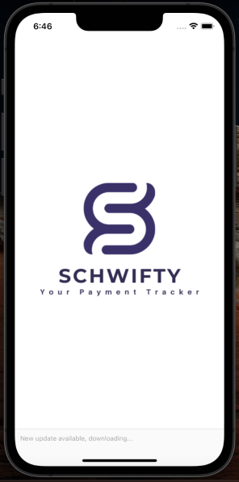
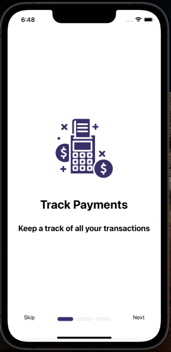
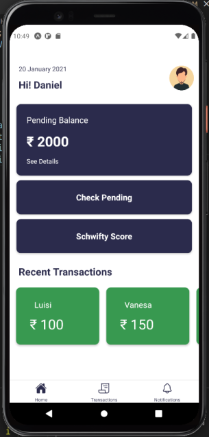

**Schwifty** is a payment tracker that helps merchants to allocate credits to customers based on their trust level and those credits are used by customers to buy products from the merchant. After the buy is over, customer use those credits to pay off the merchants and those details are stored in the database of Schwifty app. The customer can now pay of the debt after sometime and when the payment is done then those transaction details are marked as paid.

## Features of the project:
- Allows allocating credi from merchant to customer based on the trust level between merchant and customer.
- Allows customer to pay off the debt after sometime.
- Schwifty score gives an idea into the customers ability to pay off the debt, indicators like pending payment count, paid payments, loyalty points etc 

## Structure of the project:
- **Presentation**: https://docs.google.com/presentation/d/1u7O6MUzehXkvknUB8w7IxDFzkfor6J27Izpr1-1mV2o/edit?usp=sharing
- **Schwifty**
  - assets : images related to app
  - backend : database related to app written in flask
  - schwifty_app : react-native app for the client and merchant to use 
  - readme.md : this document
  - .gitignore
  
- **Youtube Video**: 
  
## Instructions To run the backend: 
```md
cd backend
conda create -n schiwiftybackend python=3.7
conda activate schiwiftybackend
pip install -r requirement.txt
./run.sh
```

## Instructions to the run the app:
Make sure that npm, expo and react native are installed on your machine.
```md
cd schwifty_app
npm install
npm start

```
## Gallery


App         |  Tutorial | Credit/Profile Page
:-------------------------:|:-------------------------: |:-------------------------:
  |   | 
**Transaction History**       |  **Payment Page** | **Notification Page**
.png) |  | .png) 

## References:
- [CIBIL SCORE](https://www.cibil.com/freecibilscore)